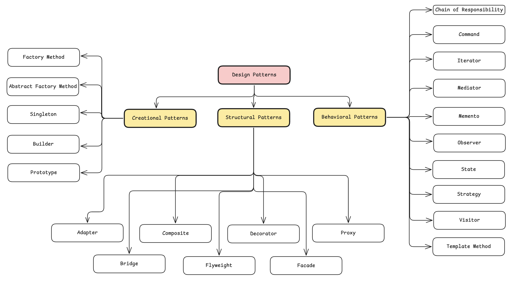
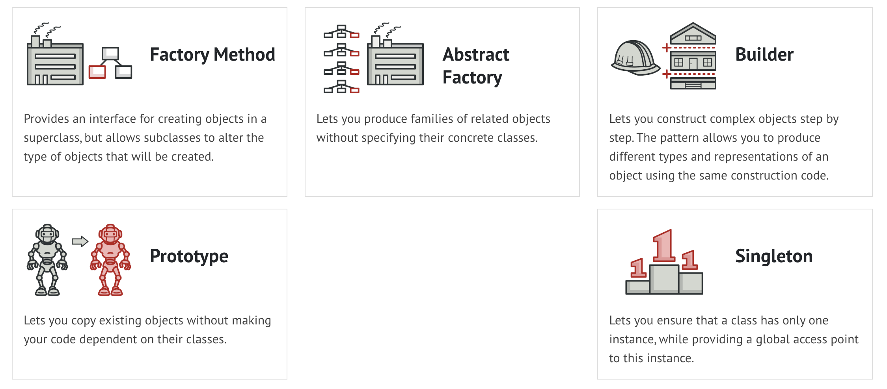
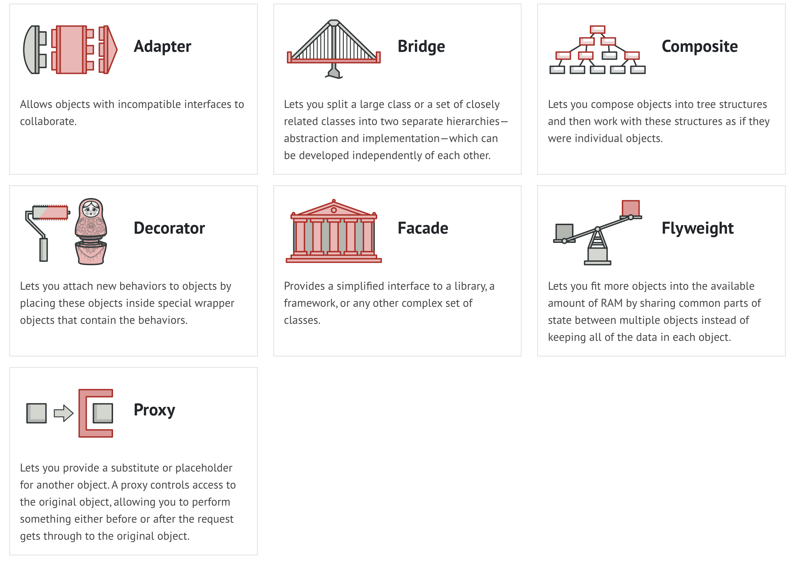
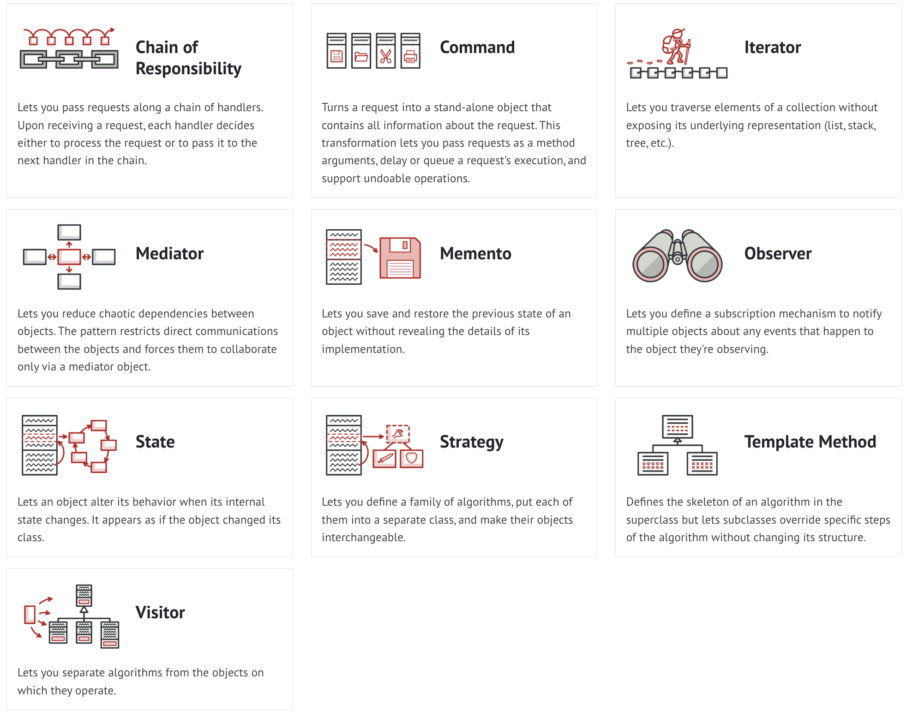

# Design Patterns

## Creational Patterns

These patterns provide various **object creation mechanisms**, which increase flexibility and reuse of existing code. 

## Structural Patterns

These patterns explain how to **assemble objects and classes into larger structures** while keeping these structures flexible and efficient.

## Behavioral Patterns

These patterns are concerned with algorithms and the assignment of **responsibilities between objects**.

